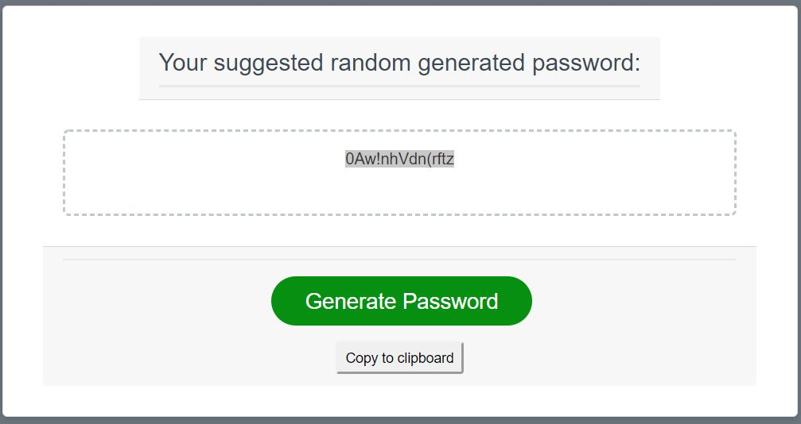

# 03 JavaScript: Password Generator

This application generates a random password based on below user-selected criteria:
* length of at least 8 characters and no more than 128 characters
* lowercase, uppercase, numeric, and/or special characters

The app will run in the browser and feature dynamically updated HTML and CSS powered JavaScript code. It also feature a clean, polished, and responsive user interface that adapts to multiple screen sizes.

When user clicks the "Generate Password" button, they are prompt for a password length of range of 8 to 128 characters.  There's a while loop that checks and required the password length between 8 to 128 characters. 

The app will then prompt the user to include numbers, characters, uppercase and/or lowercase letters. There's a check with while loop that checks for no selection of criteria, the program will ask it to select at least each one and will loop back through the prompts.

When all parameters have been satisfied, the password will appear within the password box.  There is a "Copy to clipboard" button if they want to copy the password.

Deployed link: https://mikewclee.github.io/Password-Generator/

